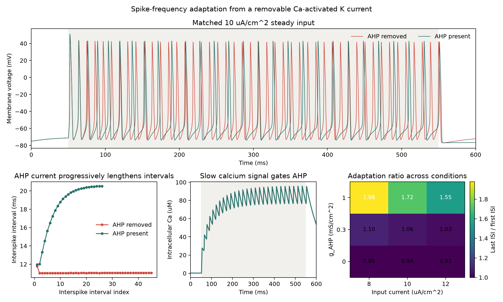

01 — Spike-frequency adaptation
===============================

This experiment isolates the slow current that turns rapid initial firing into adaptation during steady input. It uses a conductance-based cell, changes one mechanism, and checks the causal result in voltage, calcium, and interspike intervals.

Prompt
------

.. container:: prompt-bubble

   Show why a neuron fires quickly at first but gradually slows during a steady input, then remove its adaptation current and reveal what changes.

Agent decision path
-------------------

The agent first resolves the biological scale, then opens only the BrainX layers needed to construct and verify the ablation.

.. container:: agent-trace

   1. Classify the model as one isopotential conductance-based cell.
   2. Route cellular dynamics to ``braincell`` and state and units to ``brainstate`` and ``brainunit``.
   3. Select dynamic calcium plus ``AHP_De1994`` through ``MixIons(k, ca)``.
   4. Define the controlled ablation as ``g_AHP = 0`` with all other parameters fixed.
   5. Place adaptation strength and input current on independent condition axes.
   6. Evolve every condition with ``for_loop`` and summarize traces with nested ``vmap`` calls.
   7. Add a matched holding current so every stimulus starts from a quiet baseline.
   8. Record voltage, calcium, spike count, and first-to-last interspike interval.

Result
------

.. container:: result-lede

   At ``10 uA/cm^2``, the AHP-present cell slows from an ``11.96 ms`` to ``20.52 ms`` interspike interval and fires 27 spikes. With AHP removed, the interval stays nearly constant and the cell fires 46 spikes.

onic.

   Calcium provides the slow signal. Nonzero AHP conductance converts it into an outward current that progressively lengthens the firing interval.

With-BrainX skill/Without skill comparison
------------------------------------------

A matched comparison belongs here after the same prompt, environment, hardware, seed policy, and verification criteria have been run with and without the BrainX skill.

.. grid:: 1 2 2 2
   :gutter: 2
   :class-container: comparison-grid

   .. grid-item::

      **With BrainX skill**

      .. container:: pending-label

         Source captured · benchmark pending

      The generated BrainX experiment and scientific result are available above. Add measured generation time, runtime, memory, verification outcome, and code-quality criteria here.

   .. grid-item::

      **Without BrainX skill**

      .. container:: pending-label

         Matched run not collected

      Add the baseline code and evidence only after running the identical prompt and protocol. Do not infer missing speed or accuracy values.
