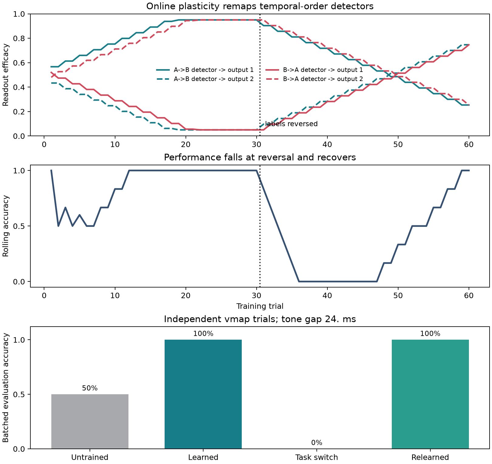

Learning temporal order
=======================

This experiment trains a small spiking circuit to identify which tone arrived first, reverses the requested label mapping without rebuilding the circuit, and continues the same plasticity process until the new rule is learned.

Prompt
------

.. container:: prompt-bubble

   Teach a small spiking circuit to recognize which of two tones came first, then reverse their order and show how the circuit relearns.

Agent decision path
-------------------

.. container:: agent-trace

   1. Classify the model as a point-neuron circuit with event-driven online learning.
   2. Route sensory, detector, and output neurons to ``brainpy-state`` and plastic communication to ``brainevent``.
   3. Build two sensory neurons, two trace-gated order detectors, and two output neurons.
   4. Keep the detector layer fixed and make only detector-to-output weights plastic.
   5. Train sequentially with nested ``for_loop`` calls so learned weights persist across trials.
   6. Reverse the teaching event while preserving the circuit and existing weights.
   7. Construct independent evaluation batches with ``vmap`` and native batch state.
   8. Verify acquisition, immediate reversal cost, relearning, and detector selectivity.

Result
------

.. container:: result-lede

   Accuracy moves from ``50%`` untrained to ``100%`` after acquisition, falls to ``0%`` immediately after label reversal, and returns to ``100%`` after relearning.

   The immediate failure after reversal establishes that the original mapping was learned; the later recovery shows plastic remapping in the same circuit.

With-BrainX skill/Without skill comparison
------------------------------------------

.. grid:: 1 2 2 2
   :gutter: 2
   :class-container: comparison-grid

   .. grid-item::

      **With BrainX skill**

      .. container:: pending-label

         Source captured · benchmark pending

      Measure training and evaluation separately while preserving sequential weight state, reversal timing, and independent evaluation state.

   .. grid-item::

      **Without BrainX skill**

      .. container:: pending-label

         Matched run not collected

      Require the same four accuracy checkpoints and weight-remapping evidence before comparing implementation or runtime.
