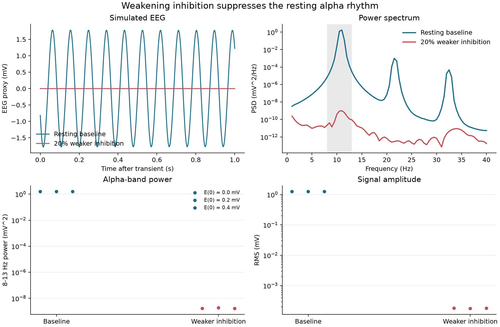

05 — Alpha rhythm
=================

This experiment constructs an interpretable cortical population rhythm and measures what changes when inhibition is weakened. The evidence combines time-domain traces, spectra, alpha-band power, and sensitivity to initial conditions.

Prompt
------

.. container:: prompt-bubble

   Create a resting cortical circuit that produces an alpha-like brain rhythm, then weaken inhibition and show how the simulated EEG changes.

Agent decision path
-------------------

.. container:: agent-trace

   1. Classify the model as aggregate cortical-population dynamics.
   2. Route the model to ``brainmass`` with ``brainstate`` transforms and ``brainunit`` quantities.
   3. Select ``JansenRitStep`` and its interpretable ``E - I`` EEG proxy.
   4. Define weaker inhibition as a reduction in inhibitory gain ``Ai``.
   5. Map two inhibition levels across three matched initial conditions.
   6. Run the six complete trajectories through one ``for_loop`` and ``vmap`` workflow.
   7. Keep millivolt quantities through simulation and convert only at the spectral boundary.
   8. Discard the transient, compute Welch spectra, and verify the script by full execution and compilation.

Result
------

.. container:: result-lede

   The baseline settles at an ``11.0 Hz`` alpha rhythm with about ``1.25 mV RMS``. Reducing inhibitory gain from ``22.0`` to ``17.6 mV`` suppresses the oscillation below the predefined ``0.001 mV RMS`` reporting floor in all three initial conditions.

   The trace, spectrum, and sensitivity panels report the same condition contrast rather than relying on a selected waveform alone.

With-BrainX skill/Without skill comparison
------------------------------------------

.. grid:: 1 2 2 2
   :gutter: 2
   :class-container: comparison-grid

   .. grid-item::

      **With BrainX skill**

      .. container:: pending-label

         Source captured · benchmark pending

      Preserve the selected mass model, unit boundary, transient policy, and spectral analysis when collecting code and runtime measurements.

   .. grid-item::

      **Without BrainX skill**

      .. container:: pending-label

         Matched run not collected

      Run the same prompt and success criteria before comparing implementation time, execution speed, or scientific validity.
