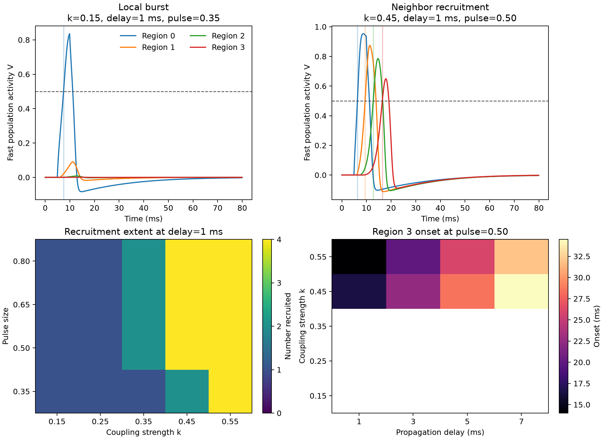

06 — Seizure recruitment
========================

This experiment asks when a finite burst remains focal and when directed coupling recruits a chain of neighboring regions. The classification is tied to continuous regional activity and onset times.

Prompt
------

.. container:: prompt-bubble

   Start a seizure-like burst in one brain region and show when it remains local and when it recruits neighboring regions.

Agent decision path
-------------------

.. container:: agent-trace

   1. Classify the task as aggregate multi-region dynamics.
   2. Route regional activity and coupling to ``brainmass``.
   3. Select a four-region ``FitzHughNagumoStep`` chain with directed additive coupling.
   4. Deliver a finite pulse only to region 0 and preserve a fixed-capacity delay history.
   5. Define recruitment before the sweep as ``V >= 0.5`` for at least ``1 ms``.
   6. Map coupling, propagation delay, and pulse amplitude across complete independent rollouts.
   7. Keep delay and duration unit-bearing while retaining peak activity and onset for every region.
   8. Verify delay phase and ordered recruitment with focused tests.

Result
------

.. container:: result-lede

   At coupling ``0.15`` and pulse ``0.35``, only region 0 is recruited. At coupling ``0.45`` and pulse ``0.50``, all four regions recruit in order at ``6.4``, ``9.5``, ``12.8``, and ``16.5 ms``. The sweep evaluates 80 parameter combinations.

   Ordered onset times distinguish propagation from simultaneous activation, while the sweep shows where distal recruitment is absent or present.

With-BrainX skill/Without skill comparison
------------------------------------------

.. grid:: 1 2 2 2
   :gutter: 2
   :class-container: comparison-grid

   .. grid-item::

      **With BrainX skill**

      .. container:: pending-label

         Source captured · benchmark pending

      Record generation time, the 80-condition runtime, memory, test outcome, and whether the regional onset order remains reproducible.

   .. grid-item::

      **Without BrainX skill**

      .. container:: pending-label

         Matched run not collected

      Use the same recruitment definition, sweep grid, and hardware before making any speed or correctness comparison.
