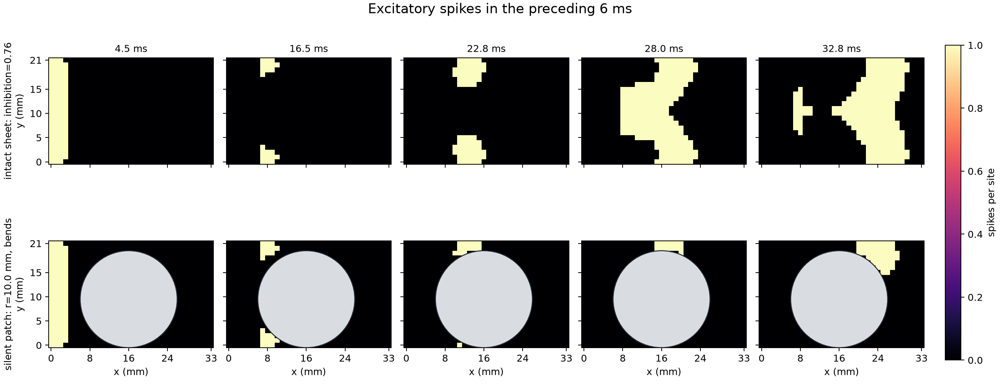
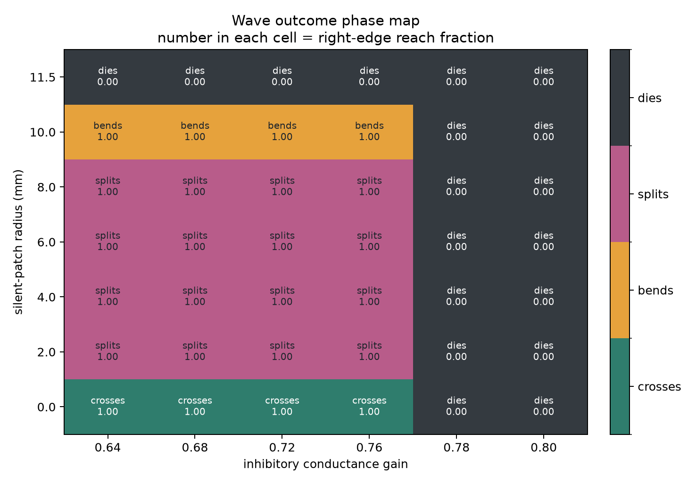

07 — Cortical wave obstacle
===========================

This experiment launches a spiking activity wave across an excitatory and inhibitory sheet, places a silent circular obstacle in its path, and maps whether the wave crosses, bends, splits, or dies.

Prompt
------

.. container:: prompt-bubble

   Create a sheet of excitatory and inhibitory neurons and trigger a brief spark at its left edge. Show the activity wave crossing the sheet, then place a silent circular patch in its path and reveal whether the wave bends around it, splits, or dies. Sweep the patch size and inhibition strength and summarize the outcomes in a phase map.

Agent decision path
-------------------

.. container:: agent-trace

   1. Classify the model as a spatial point-neuron E/I network.
   2. Route neural dynamics to ``brainpy-state`` and sparse spikes to ``brainevent``.
   3. Place one excitatory and one inhibitory LIF neuron at each sheet position.
   4. Build explicit local CSR projections and launch a ``3 ms`` left-edge current pulse.
   5. Silence the obstacle with both a hyperpolarizing clamp and spike mask.
   6. Map seven lesion radii and six inhibitory gains to independent state lanes.
   7. Define crossing, bending, splitting, and death from far-edge reach and bypass-corridor activation.
   8. Save the storyboard, quantitative phase map, outcomes, and focused checks.

Result
------

.. container:: result-lede

   The 42-condition sweep produces 4 crossings, 16 splits, 4 one-sided bends, and 18 deaths. Each phase-map label is paired with the measured right-edge reach fraction.

   Matched snapshots make the spatial perturbation visible.

   The phase map connects each qualitative outcome to the continuous reach measurement used to classify it.

With-BrainX skill/Without skill comparison
------------------------------------------

.. grid:: 1 2 2 2
   :gutter: 2
   :class-container: comparison-grid

   .. grid-item::

      **With BrainX skill**

      .. container:: pending-label

         Source captured · benchmark pending

      Measure the same 42 conditions with compilation, execution, memory, and nonblank-artifact checks reported separately.

   .. grid-item::

      **Without BrainX skill**

      .. container:: pending-label

         Matched run not collected

      Preserve topology, grid size, obstacle intervention, and phase definitions before comparing code or performance.
