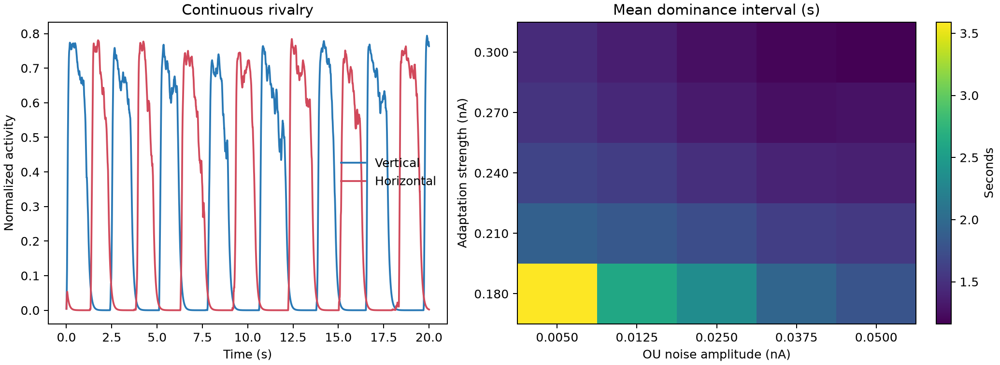

Binocular rivalry
=================

This experiment models two continuously driven visual populations whose competition, fatigue, and noise produce alternating percepts. It maps the mechanism across a population of simulated observers instead of relying on one trace.

Prompt
------

.. container:: prompt-bubble

   Model two competing visual populations, one seeing vertical stripes and the other horizontal stripes. Present both continuously so perception alternates between them, then simulate many observers with different adaptation and noise levels and explain what controls how long each percept dominates.

Agent decision path
-------------------

.. container:: agent-trace

   1. Classify the task as population-level perceptual competition.
   2. Route competition to ``brainmass`` and mutable adaptation and noise to ``brainstate``.
   3. Select two reduced Wong–Wang populations with mutual inhibition and equal continuous drive.
   4. Add a slow self-adaptation current and Ornstein–Uhlenbeck current noise.
   5. Define dominance with a fixed hysteresis threshold after a discarded transient.
   6. Map 12 independent observers over a ``5 x 5`` adaptation and noise grid.
   7. Use ``for_loop`` for time and state-aware ``vmap`` for observer lanes.
   8. Store observer-level metrics and verify alternation, occupancy, and nonblank artifacts.

Result
------

.. container:: result-lede

   All 300 observers alternate. Mean dominance falls from ``2.46 s`` to ``1.29 s`` as adaptation increases and from ``2.03 s`` to ``1.43 s`` as noise increases. Equal drive produces ``50.31%`` vertical occupancy.

   Stronger adaptation accelerates winner fatigue; stronger noise increases escape from the current attractor.

With-BrainX skill/Without skill comparison
------------------------------------------

.. grid:: 1 2 2 2
   :gutter: 2
   :class-container: comparison-grid

   .. grid-item::

      **With BrainX skill**

      .. container:: pending-label

         Source captured · benchmark pending

      Benchmark the same 300 observers and retain alternation, occupancy, and dominance-duration checks with the runtime data.

   .. grid-item::

      **Without BrainX skill**

      .. container:: pending-label

         Matched run not collected

      Hold the observer grid, random policy, analysis window, and dominance definition fixed.
