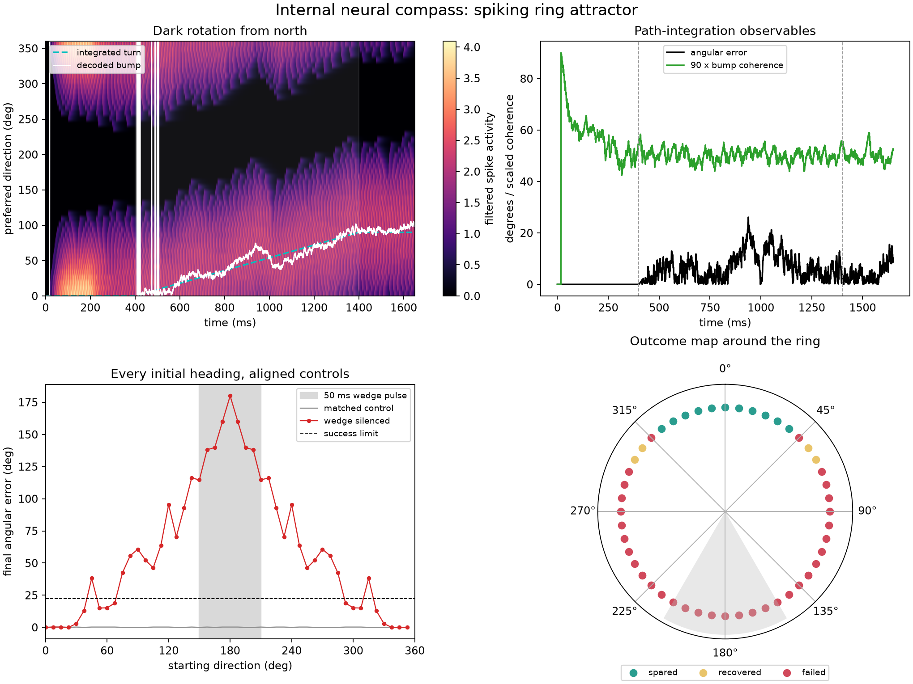

09 — Neural compass
===================

This experiment builds a spiking ring attractor that stores heading as an activity bump, integrates a dark turn, and then maps recovery after a sector of the ring is silenced.

Prompt
------

.. container:: prompt-bubble

   Build a ring of head-direction neurons that holds an activity bump like an internal compass. Point it north, rotate the animal in darkness, and show whether the bump follows the turn. Then silence a wedge of the ring and test every starting direction to discover when the compass recovers or fails.

Agent decision path
-------------------

.. container:: agent-trace

   1. Classify the mechanism as a point-neuron recurrent attractor.
   2. Route neurons to ``brainpy-state`` and delayed binary communication to ``brainevent``.
   3. Construct 48 head-direction neurons with dense ring connectivity.
   4. Encode angular velocity as a signed bias on recurrent transmission.
   5. Cue north, remove the landmark, and integrate a ``90 degree/s`` dark turn.
   6. Silence a ``60 degree`` wedge and preserve matched intact controls.
   7. Map all 48 starting headings with state-aware ``vmap2`` inside the time loop.
   8. Classify spared, recovered, and failed states from error, coherence, activity, and departure.

Result
------

.. container:: result-lede

   The bump moves ``94.9 degrees`` during a commanded ``90 degree`` turn. Across 48 starting headings after the lesion, 11 are spared, 4 recover, and 33 fail.

   Continuous heading error and bump coherence support the recovery labels rather than leaving them as visual judgments.

With-BrainX skill/Without skill comparison
------------------------------------------

.. grid:: 1 2 2 2
   :gutter: 2
   :class-container: comparison-grid

   .. grid-item::

      **With BrainX skill**

      .. container:: pending-label

         Source captured · benchmark pending

      Preserve all headings, matched controls, delay checks, and recovery predicates when measuring execution and code generation.

   .. grid-item::

      **Without BrainX skill**

      .. container:: pending-label

         Matched run not collected

      Compare only after the baseline reproduces the same lesion protocol and continuous metrics.
