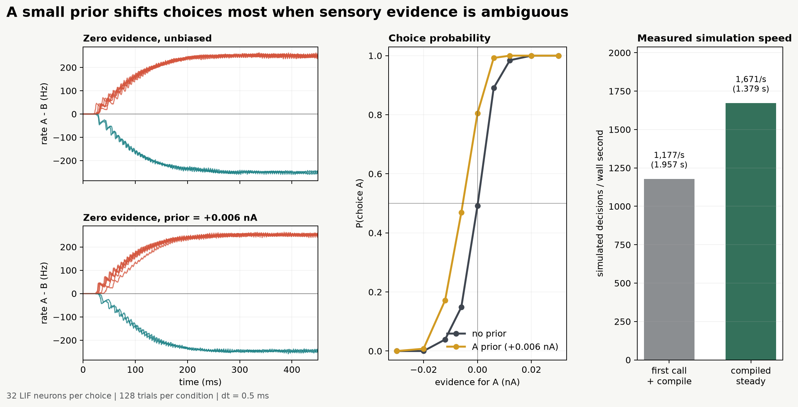

10 — Prior bias
===============

This experiment tests whether a small prior changes choices mainly when sensory evidence is ambiguous. It measures the psychometric effect and the throughput of the compiled stateful rollout.

Prompt
------

.. container:: prompt-bubble

   Does a small prior bias change a decision mainly when the evidence is ambiguous? Build a noisy two-choice brain circuit, compare unbiased and slightly biased decisions from weak to strong evidence, show several choices unfolding, and plot the resulting choice probabilities and measured simulation speed.

Agent decision path
-------------------

.. container:: agent-trace

   1. Classify the task as a point-neuron stochastic decision circuit.
   2. Route two LIF choice populations to ``brainpy-state`` with recurrent excitation and mutual inhibition.
   3. Define the prior as ``+0.006 nA`` against evidence from ``-0.030`` to ``+0.030 nA``.
   4. Give every evidence, prior, and trial lane independent neural and random state.
   5. Use ``for_loop`` for evidence accumulation and ``vmap2`` for the trial ensemble.
   6. Compile the complete reset-and-rollout operation with state-aware ``jit``.
   7. Separate first-call throughput from steady compiled throughput.
   8. Check that ambiguous-evidence choice shifts exceed strong-evidence shifts.

Result
------

.. container:: result-lede

   Mean prior-induced choice shift is ``0.245`` under ambiguous evidence and ``0.002`` under strong evidence. Measured throughput is ``1,177 decisions/s`` including compilation and ``1,671 decisions/s`` after compilation on the recorded machine.

   The behavioral effect and measured execution rate are reported in the same experiment without conflating first-call and steady compiled timing.

With-BrainX skill/Without skill comparison
------------------------------------------

.. grid:: 1 2 2 2
   :gutter: 2
   :class-container: comparison-grid

   .. grid-item::

      **With BrainX skill**

      .. container:: pending-label

         Result measured · matched benchmark pending

      The selected run records first-call and steady compiled throughput. A fair comparison still needs matched hardware, versions, lane count, warm-up, and scientific checks.

   .. grid-item::

      **Without BrainX skill**

      .. container:: pending-label

         Matched run not collected

      Report both compilation-inclusive and steady timings, then verify the same ambiguous-versus-strong evidence effect.
