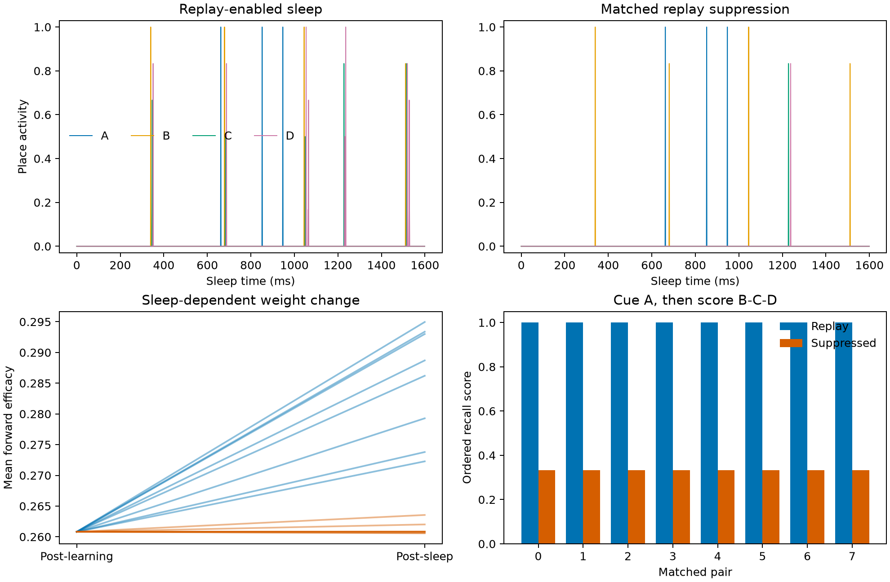

Sleep memory replay
===================

This experiment learns a four-place route, runs matched networks through an uncued sleep period, suppresses recurrent replay in one group, and compares ordered recall after cueing only the first place.

Prompt
------

.. container:: prompt-bubble

   Teach a spiking network the sequence of four places along a route. Let it run without external input during a sleep-like period and reveal whether the route replays forward or backward. Suppress replay in a matched group and compare how well each network recalls the route afterward.

Agent decision path
-------------------

.. container:: agent-trace

   1. Classify the model as a recurrent spiking place-cell circuit with plasticity across learning, sleep, and recall.
   2. Route neurons to ``brainpy-state`` and synaptic events and learning to ``brainevent``.
   3. Train four place assemblies on the ordered route ``A -> B -> C -> D``.
   4. Match learned weights, neural state, sleep inputs, and recall protocol within every pair.
   5. Gate only excitatory recurrent transmission during sleep in the suppression group.
   6. Detect forward and backward replay symmetrically from assembly threshold crossings.
   7. Calibrate a transient, non-runaway recurrent regime and keep external place cues identically zero during sleep.
   8. Save all spikes, weights, event labels, and recall scores, then reproduce summaries from the stored evidence.

Result
------

.. container:: result-lede

   Across eight matched pairs, replay-enabled sleep produces 2 forward and 0 backward route events; replay suppression produces no complete route events. Ordered recall is ``1.000`` with replay and ``0.333`` with suppression.

   Pre-sleep learned weights match within every pair, and external place-cue input remains zero throughout sleep; the intervention isolates recurrent replay transmission.

With-BrainX skill/Without skill comparison
------------------------------------------

.. grid:: 1 2 2 2
   :gutter: 2
   :class-container: comparison-grid

   .. grid-item::

      **With BrainX skill**

      .. container:: pending-label

         Source captured · benchmark pending

      Measure learning, sleep, and recall separately and keep the matched-pair causal invariants as acceptance criteria.

   .. grid-item::

      **Without BrainX skill**

      .. container:: pending-label

         Matched run not collected

      Require identical pre-sleep weights, zero external sleep cues, the same suppression gate, and stored replay evidence.
