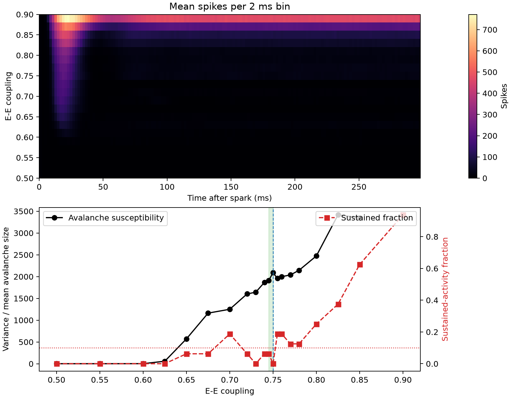

12 — Edge of criticality
========================

This experiment sweeps recurrent excitation across matched sparse spiking networks to locate a narrow, highly variable region that remains below a predefined instability limit.

Prompt
------

.. container:: prompt-bubble

   Start with a recurrent spiking network where a single spark usually fades away. Gradually strengthen excitation until sparks become neural avalanches and finally runaway activity. Across many network realizations, locate the narrow region where activity is most variable without becoming unstable.

Agent decision path
-------------------

.. container:: agent-trace

   1. Classify the model as a recurrent point-neuron E/I network with sparse event communication.
   2. Route neurons to ``brainpy-state`` and strictly positive sparse E-to-E weights to ``brainevent``.
   3. Replace a single-cell spark with one brief pulse to an eight-neuron seed assembly so finite propagation is possible.
   4. Match independently seeded network realizations across all coupling values.
   5. Run coupling-realization lanes through stateful ``vmap2`` inside one time ``for_loop``.
   6. Define avalanche susceptibility and runaway activity before selecting the critical region.
   7. Freeze calibration, use a held-out seed set, and refine only midpoint samples at the boundary.
   8. Recompute saved metrics from raw binned counts and run four focused checks.

Result
------

.. container:: result-lede

   A held-out 320-lane ensemble locates a stable critical region at E-to-E coupling ``0.745–0.750``. The sampled optimum is ``0.750`` with susceptibility ``2089.73`` and ``0/16`` unstable realizations; runaway probability rises sharply above it.

   The reported interval must contain adjacent samples, remain below the instability cap, and reach at least 90 percent of the stable susceptibility peak.

With-BrainX skill/Without skill comparison
------------------------------------------

.. grid:: 1 2 2 2
   :gutter: 2
   :class-container: comparison-grid

   .. grid-item::

      **With BrainX skill**

      .. container:: pending-label

         Source captured · benchmark pending

      Record compile time, full held-out sweep time, peak memory, and raw-count agreement for the fixed 320-lane protocol.

   .. grid-item::

      **Without BrainX skill**

      .. container:: pending-label

         Matched run not collected

      Use the same sparse graphs, seed set, coupling grid, thresholds, and midpoint-refinement rule.
