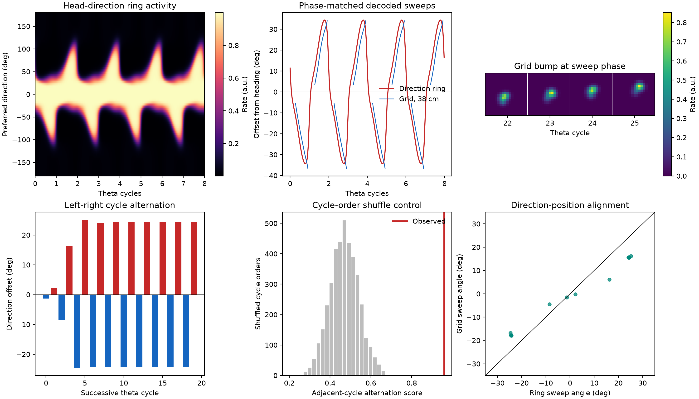

Grid-cell theta sweep
=====================

This experiment tests whether theta modulation and firing-rate adaptation can generate alternating direction and position sweeps in a coupled head-direction and grid-cell model motivated by published mechanisms.

Prompt
------

.. container:: prompt-bubble

   Develop a firing-rate model in which an internal direction signal organizes subsecond spatial sweeps during open-field navigation. Build a theta-modulated head-direction ring attractor with local recurrent excitation, global inhibition, sensory anchoring to the animal's head direction, and slow firing-rate adaptation. Couple it through a conjunctive direction-by-grid transformation to one or more two-dimensional toroidal grid-cell attractors. The projection must convert the direction-ring state into a spatially shifted input rather than impose a decoded trajectory directly.

   Simulate straight runs, changes in running speed, and turning in a two-dimensional arena. Decode internal direction and grid-cell position within individual theta cycles. Determine whether firing-rate adaptation and theta modulation generate sweeps that alternate left and right across successive cycles, and whether direction and position sweeps remain aligned. Report the model and analysis definitions, matched controls, quantitative summaries, and a trajectory with 10 decoded sweep vectors.

Agent decision path
-------------------

.. container:: agent-trace

   1. Classify the direction ring and grid sheets as aggregate firing-rate populations owned by ``brainmass``.
   2. Implement a custom direction-grid step because the public model catalogue has no matching ring-torus composition.
   3. Store activation, rate, and adaptation in BrainState ``HiddenState`` objects.
   4. Convert the distributed direction-ring state into spatially shifted toroidal input before decoding either population.
   5. Wrap each complete time rollout in ``jit`` and ``for_loop``, then map the adaptation scan with ``vmap``.
   6. Keep time, theta frequency, speed, heading, position, and grid scale explicit with ``brainunit``.
   7. Compare straight, speed-change, and turning protocols with matched no-adaptation, no-theta, and no-coupling controls.
   8. Measure adjacent-cycle alternation, a cycle-order shuffle null, ring-grid alignment, and exactly 10 trajectory vectors.

Result
------

.. container:: result-lede

   Straight-run direction sweeps alternate with score ``0.959`` versus a shuffled mean of ``0.469`` (``p = 0.00025``). Grid sweeps alternate with score ``0.939`` and align with the direction ring at cosine ``0.990–0.991``. Removing adaptation or theta abolishes alternation; removing the conjunctive projection preserves ring alternation but abolishes grid alternation.

   The shuffle test distinguishes ordered left-right alternation from the same cycle angles in random order, while matched ablations identify the adaptation-theta interaction and conjunctive projection as separate mechanism requirements.

With-BrainX skill/Without skill comparison
------------------------------------------

.. grid:: 1 2 2 2
   :gutter: 2
   :class-container: comparison-grid

   .. grid-item::

      **With BrainX skill**

      .. container:: pending-label

         Source captured · benchmark pending

      Preserve the equations, matched initialization, theta-phase decoder, shuffle test, and mechanism controls when measuring execution and code generation.

   .. grid-item::

      **Without BrainX skill**

      .. container:: pending-label

         Matched run not collected

      Compare only after the baseline implements a distributed direction-to-grid projection rather than commanding a decoded trajectory directly.
